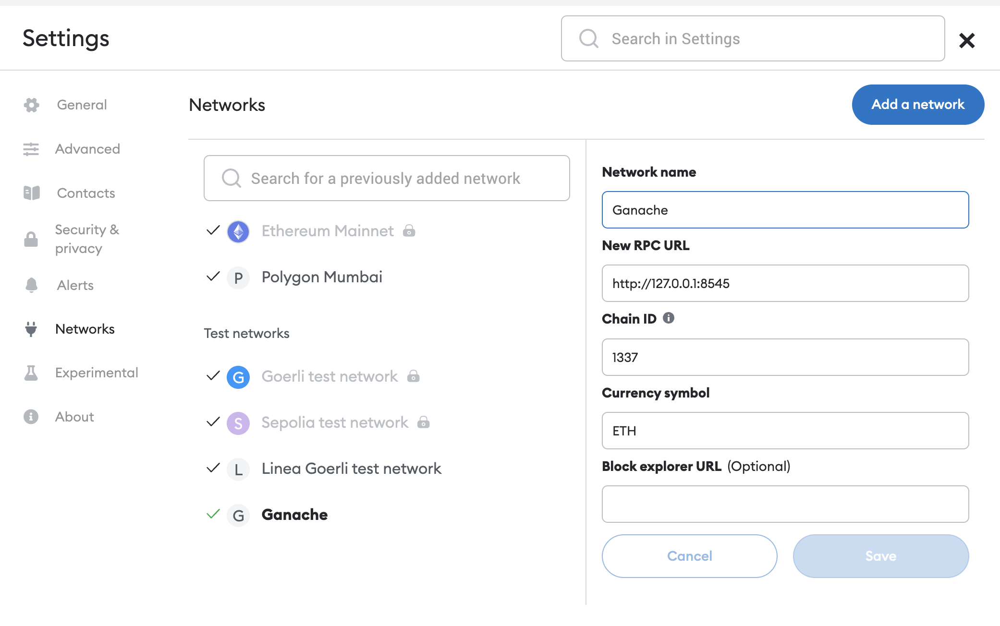
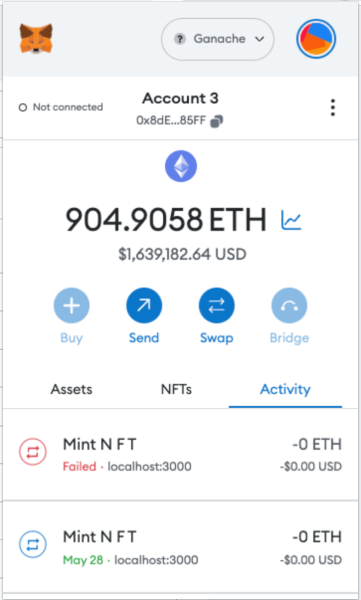
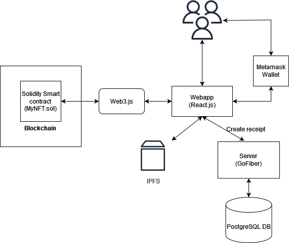
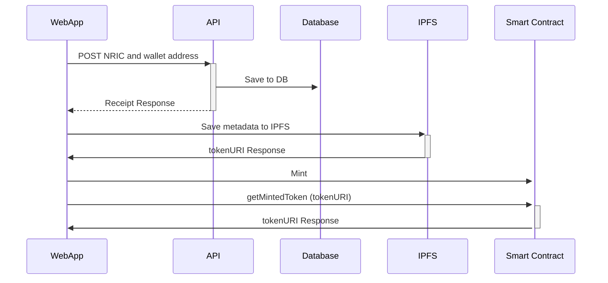

# NFT-PORTAL
A place for users to mint NFT with their NRIC and wallet address

## Prerequisites
- Node.js ^v16.20.0
- Metamask
- Ganache UI or ganache-cli
- Truffle@latest framework
- InterPlanetary File System / IPFS
- Docker
- Docker-compose

## Step by step guide to setup
The below instructions are assuming you have linux or MAC machine with bash shell terminal
### Create local Ethereum Blockchain using ganache-cli
- Download and install Ganache UI or ganache-cli from https://www.trufflesuite.com/ganache or just run 
```bash
npm install -g ganache
```

- next, in order to create a local Ethereum Blockchain, run 
```bash
ganache-cli -a 20 -e 1000  -m "sun moon earth test test test test test test test test test okay" -i 1337
```

- You should see the local accounts together with their private keys:
```bash
ganache v7.8.0 (@ganache/cli: 0.9.0, @ganache/core: 0.9.0)

Starting RPC server 
Available Accounts
================== 
(0) 0x50724CA40d6A63D363b997a734f869CAD2e8c1Bd (1000 ETH)
(1) 0x323B3E3aCb706aB0595b6444D1a112489d8C783d (1000 ETH)
(2) 0xDBEfCef09B5643a92e3aEa3c5cA903443D5C90cA (1000 ETH)
(3) 0x8CFCcA3FFCf5A607Da06eC87571c029e2F956D0e (1000 ETH)
(4) 0x6798a4516705a28a119D3fEeE6abCFc53DBb43c6 (1000 ETH)

....
Private Keys
==================
(0) 0x6ff4b5dea0a153ae1f389e6877cc80615ac2f4926a93ec86d4b3c67e68a7e288
(1) 0x8fcb17f1839de736cc1d9a7c3711f9823013697b4e5b9e424f3681982ddf2cab
(2) 0xfc83d3ae985d918fab48ebb6ea76e2114b29b82ddea2a85bb54728fb11f66b51
(3) 0x1ec4e4f9e6d48fe7159fce76c1fcc0c8fd9dffa6f6db7b683b2f40be1719f70a
(4) 0x29b34272447028d88906a1a3563f82fb2bc71cecc3f8b8680406010212de6a9d 
...
```

### Connect Metamask to your local Ethereum Blockchain
- Install Metamask in your web browser
- Connect Metamask to your local Ethereum Blockchain


- Import the private keys of the accounts generated by Ganache UI or ganache-cli
After import, you should see the account information. 



### Setup IPFS Storage

- Install IPFS on your local machine 
Link to download IPFS  https://docs.ipfs.tech/install/command-line/#install-official-binary-distributions

For Ubuntu OS, just run : 
```bash
wget https://dist.ipfs.tech/kubo/v0.20.0/kubo_v0.20.0_linux-amd64.tar.gz
tar -xvzf kubo_v0.20.0_linux-amd64.tar.gz
cd kubo
sudo bash install.sh
ipfs --version
```
You can find the detail instructions for your OS in the link above. 

- Start IPFS daemon
```bash
ipfs init
ipfs config --json API.HTTPHeaders.Access-Control-Allow-Origin '["http://localhost:3000"]'
ipfs config --json API.HTTPHeaders.Access-Control-Allow-Methods '["PUT", "POST", "GET"]'
ipfs daemon
```

- [Optional] Add your image file to IPFS 
- This is an optional step, we will use this as image link later when minting NFT
- You could also use any public image link
```bash
ipfs add <your file>
```
example, 
```bash
ipfs add ./gallery/1.png

added QmcsRmpwMUBqfVq6wq4zTCQA3ATHDp8bcyLigrmoEikTio 1.png
 135.31 KiB / 135.31 KiB [==========================================================================================================================] 100.00%
```

- you can access the file from IPFS by using the hash of the file, open your web browser: `http://localhost:8080/ipfs/<hash of the file>`
```bash
http://localhost:8080/ipfs/QmcsRmpwMUBqfVq6wq4zTCQA3ATHDp8bcyLigrmoEikTio
```

## Deployment
Once we finished with the setups above, we can deploy and run
### Migrate smart contract
If you haven't done so yet, 
```bash
git clone git@github.com:alvinvoo/nft-portal.git
cd nft-portal
npm install
```
The below command will compile, migrate the smart contract and copy the JSON interface file into src/
```bash
npm run migrate
```
You should see the migration script output.

If you switch over to ganache-cli console, you should also see the transaction that created the contract
```bash
eth_sendTransaction

  Transaction: 0x5d02141224d534e335c2c80dbf5c2d90e52c81067b562ac705d9d41336f9bba3
  Contract created: 0x595b371fb87f318f95c13459a8d99468808b5f4b                                             Gas usage: 3326664
  Block number: 1
  Block time: Wed Jul 05 2023 14:14:20 GMT+0800 (Singapore Standard Time)
```

### Starting Server
Ensure you have docker and docker-compose installed
```bash
cd server
cp .env.example .env
<you can change the db details in .env or leave it as it is>
docker-compose up
```

### Staring Webapp
```bash
cd client
npm install
npm start
```

The browser should be opened up by now. And you should see the app at localhost:3000.

## Debugging
If you are interested to read the state of the smart contract, you can use `truffle console`

Run the command in `nft-portal/` directory

For e.g. To check the totalSupply, mintedToken and Receipt
```bash
truffle(development)> let instance = await MyNFT.deployed()
undefined
truffle(development)> instance.address
'0x595b371fb87f318F95c13459a8D99468808B5F4B'
truffle(development)> await instance.totalSupply()
BN { negative: 0, words: [ 1, <1 empty item> ], length: 1, red: null } 
truffle(development)> await instance.getMintedToken("0x50724CA40d6A63D363b997a734f869CAD2e8c1Bd")
'http://localhost:8080/ipfs/QmZDDvixggUgN9rMj6J89Mh3wj4ERKRQstuabRFKRVsfqs'
truffle(development)> await instance.getReceipt("0x50724CA40d6A63D363b997a734f869CAD2e8c1Bd")
'e0ce6af94f81d2c70d3f57e349e7450596611f8880f1a39e240985b991e92337'
```

## Architecture


## Sequence diagram of Mint flow


## Question
### Explain why choose hash over encrypt for Receipt response
I have chosen to hash the Receipt response instead of encrypting it. 

Since NRIC is a PII, it is generally not recommended to store it on chain because it will be publicly visible to everyone. Hashing isn't really a better option, but at least there's no need to manage encryption keys with this approach. Whoever has access to these keys can decrypt the data. This introduces a central point of failure: if the keys are lost, the data is lost; if the keys are stolen, the data can be decrypted by the thief.

## TODOs / bugs
1. Any on chain transaction will take some time to confirm, currently I just get the minted tokens straight after the minting is done. It's better to have a polling mechanism that loop for the completion of `receipt = await web3.eth.getTransactionReceipt(txHash);`
2. Each NFT Token should be unique. This is checked in the contract here `require(!tokenExists[tokenURI], "Token already exists");`. But currently frontend doesn't have any check on the metadata fields. That means, the transaction will fail without error if the metadata repeats existings ones.
3. The current flow of first creating the receipt (storing the NRIC and wallet address) will have issue if user later on cancel the transaction (on MetaMask, or some other tx failure). Since the row is already created in DB, the same user will be blocked to mint again the next time. A proper solution would be to introduce a `isMinted` column, and let the callback of 1. update it (via another API call).
4. Environment variables for React.js. Currently they are hardcoded.
5. Dynamic generation of NFT images. Currently its manually provided by user.
