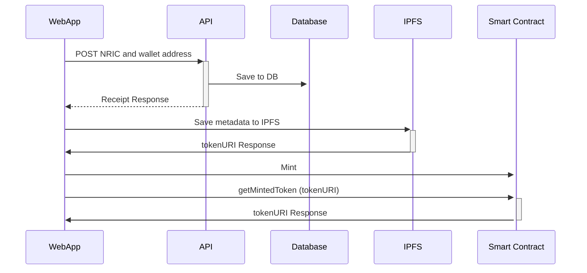

```mermaid
sequenceDiagram
  participant A as WebApp
  participant B as API
  participant C as Database
  participant D as IPFS
  participant E as Smart Contract

  A->>+B: POST NRIC and wallet address
  B->>+C: Save to DB
  B-->>-A: Receipt Response
  A->>+D: Save metadata to IPFS
  D->>-A: tokenURI Response
  A->>+E: Mint
  A->>+E: getMintedToken (tokenURI)
  E->>-A: tokenURI Response
```